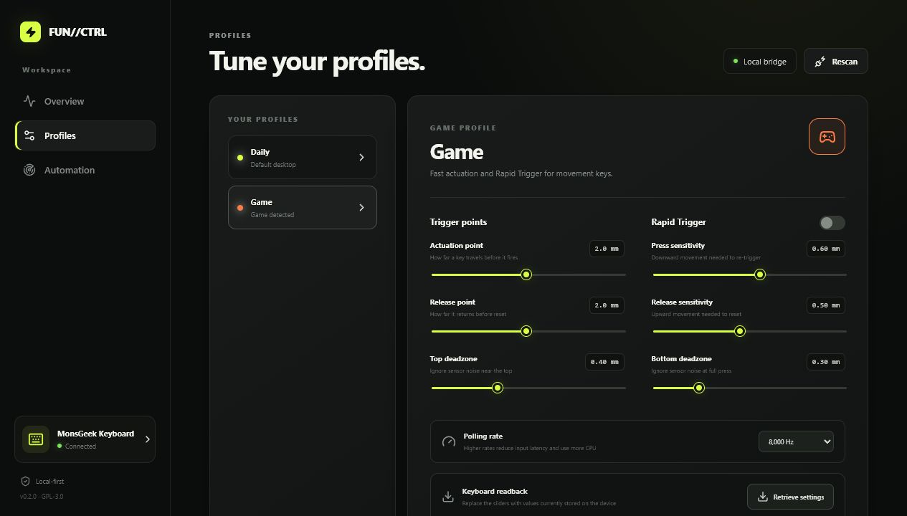

# FUN//CTRL

[](https://github.com/Aysksream/fun60-control/actions/workflows/ci.yml)
[](LICENSE)
[](#requirements)

A local-first controller for MonsGeek FUN60 Hall Effect keyboards, with a
browser-based configuration interface and automatic game profile switching.



## Highlights

- Configure actuation, release, Rapid Trigger sensitivity, deadzones, and
  polling rate.
- Read the keyboard's live per-key settings and firmware precision without
  writing to the device.
- Switch automatically between desktop and game profiles based on running
  Windows processes.
- Restore keyboard factory defaults behind an explicit confirmation step.
- Refuse HID writes to USB devices outside the supported FUN60 allowlist.
- Run entirely on the local machine; process names and profiles are never sent
  to a remote service.

## Requirements

- Windows 10 or Windows 11
- Node.js 22 or newer
- A supported FUN60 connected over USB
- The official MonsGeek driver closed while FUN//CTRL is accessing the keyboard

## Quick start

Run `Start-Fun60.ps1`, or start it manually:

```powershell
npm install
npm run build
npm start
```

Open [http://127.0.0.1:3815](http://127.0.0.1:3815). Keep the bridge running for
automatic profile switching.

Application data is stored in:

```text
%APPDATA%\Fun60Control\settings.json
```

## Reading keyboard settings

Open **Profiles** and select **Retrieve settings**. FUN//CTRL reads the current
trigger tables, polling rate, firmware version, and native precision factor.
When the device contains per-key differences, the readback cards show the
dominant value, range, and number of matching keys.

RY5088 travel values use firmware-dependent fixed-point precision:

| Firmware version | Factor | Native step |
| --- | ---: | ---: |
| Below 768 | ×10 | 0.100 mm |
| 768–1279 | ×100 | 0.010 mm |
| 1280 and newer | ×200 | 0.005 mm |

The firmware version is queried before every write, preventing profile values
from being encoded with the wrong scale.

## Automatic profile switching

The Windows bridge checks running process names every two seconds. Matching is
case-insensitive, exact after removing an optional `.exe` suffix, and protected
by a configurable transition delay.

Rules are managed from the **Automation** screen. Examples include `valorant`,
`cs2`, `r5apex`, and `fortniteclient-win64-shipping`.

## Supported devices

FUN//CTRL currently accepts USB vendor ID `3151` with the following product IDs:

| VID | PID | Status |
| --- | --- | --- |
| `3151` | `5029` | Hardware readback verified |
| `3151` | `502D` | Protocol-compatible allowlist entry |
| `3151` | `502E` | Protocol-compatible allowlist entry |
| `3151` | `502F` | Protocol-compatible allowlist entry |
| `3151` | `5030` | Protocol-compatible allowlist entry |

If a FUN60 variant reports a different identifier, open a compatibility issue
with its VID, PID, firmware version, connection type, and model name. Unknown
devices remain read/write blocked by design.

## Architecture

| Component | Runtime | Responsibility |
| --- | --- | --- |
| React/Vite interface | Browser or local bridge | Profile editing and status |
| WebHID adapter | Chrome or Edge | Manual control while the page is open |
| Windows bridge | `127.0.0.1:3815` | HID access, storage, and process detection |

The static interface can be deployed to Vercel using the included
`vercel.json`. Background automation always requires the Windows bridge because
a hosted application cannot inspect local processes or USB devices.

See [Architecture](docs/architecture.md) for protocol and trust-boundary details.

## Development

Run the interface and bridge in separate terminals:

```powershell
npm run dev:bridge
npm run dev
```

The development interface is available at
[http://127.0.0.1:5173](http://127.0.0.1:5173).

Before submitting changes:

```powershell
npm run check
npm audit
```

See [CONTRIBUTING.md](CONTRIBUTING.md) for coding, testing, and hardware safety
guidelines.

## Current scope

Profiles currently apply one set of values to all 61 keys. Per-key editing,
DKS, Snap Tap, lighting, macros, calibration, wireless transport, firmware
updates, and a packaged tray executable are not implemented yet.

Factory reset changes device-resident configuration but preserves locally saved
FUN//CTRL profiles. The action requires typing `RESET` before the bridge sends
the keyboard reset command.

## License and attribution

FUN//CTRL is licensed under [GPL-3.0-only](LICENSE).

The RY5088 protocol implementation is informed by the GPL-3.0
[monsgeek-akko-linux](https://github.com/echtzeit-solutions/monsgeek-akko-linux)
project. See [THIRD_PARTY_NOTICES.md](THIRD_PARTY_NOTICES.md).

FUN//CTRL is an independent project and is not affiliated with or endorsed by
MonsGeek or Akko.
